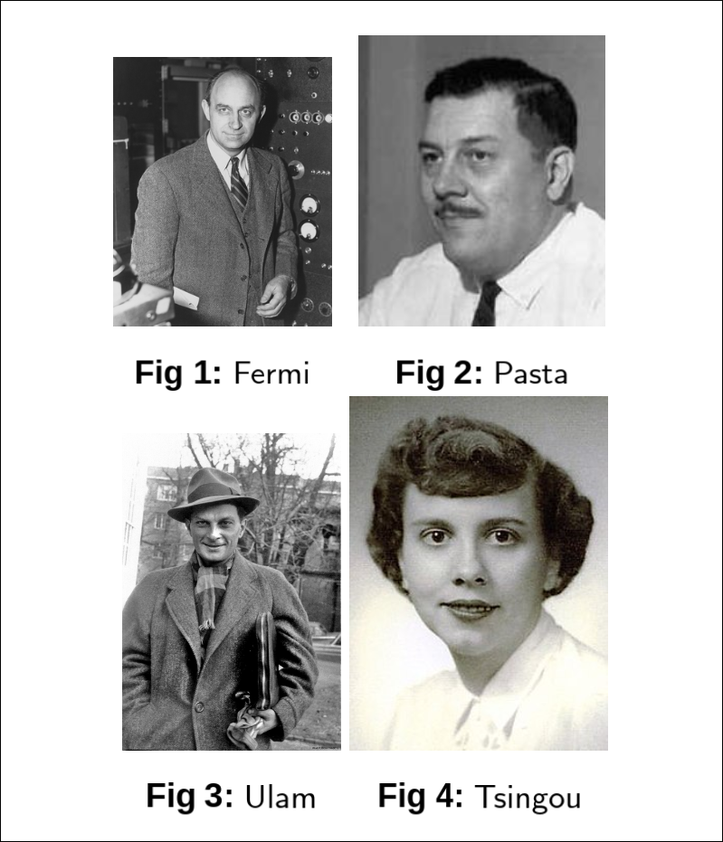
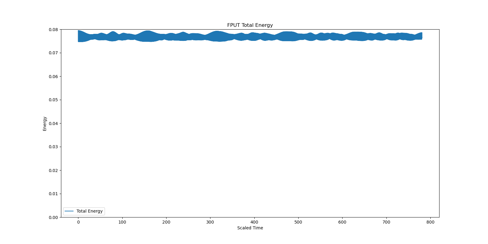
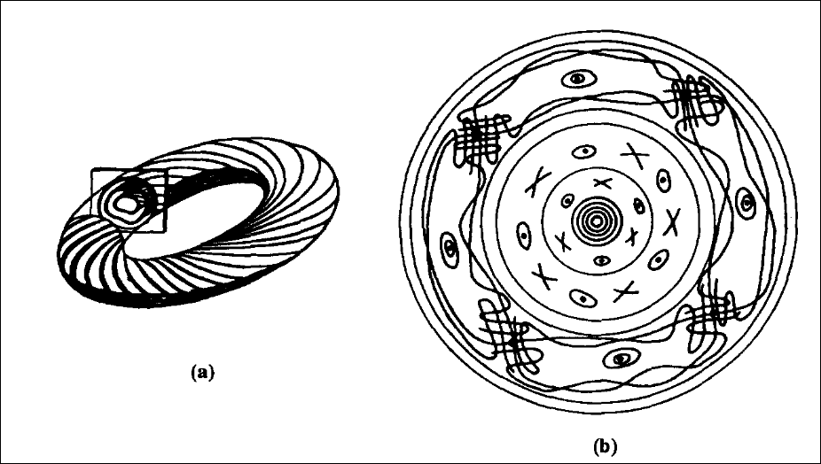
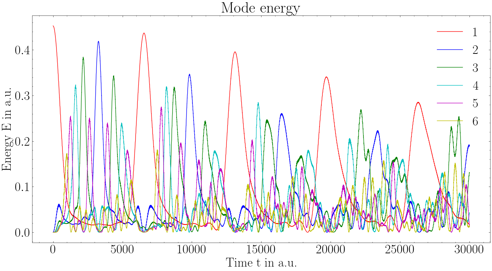
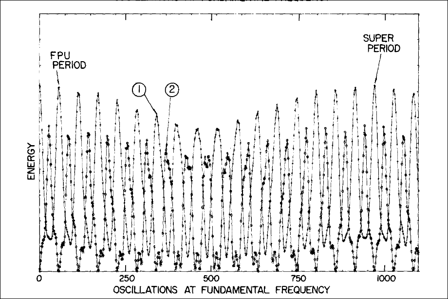
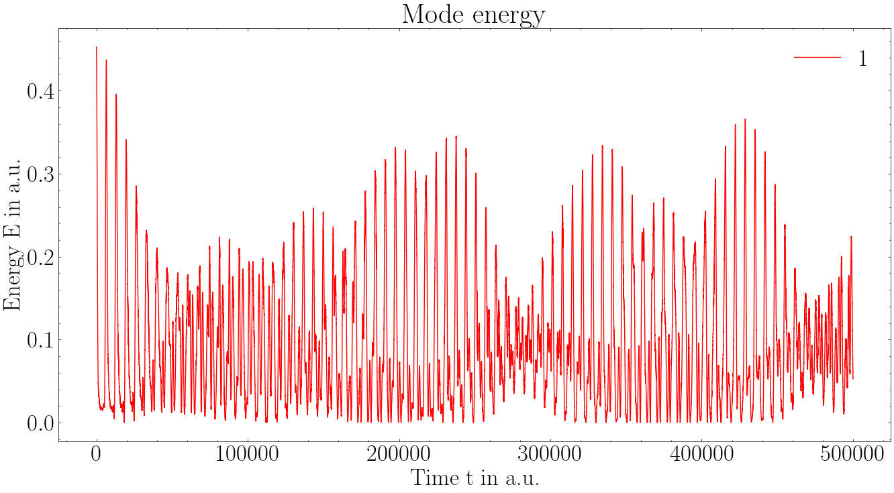
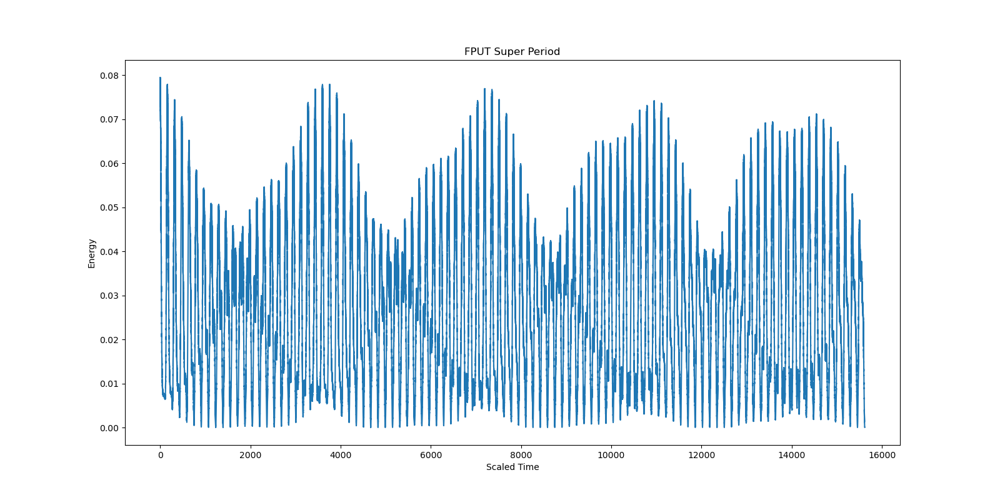

+++
author = "Sabarno Saha"
date= 2025-12-26
title = "FPUT"
[params]
  math = true
+++

Continuing the lazy turn of events, the second blog on my very "frequently updated" website, is brought to you
by another term project of mine, courtesy of my Non linear Dynamics professor and the geniuses over at Los Alamos,namely 
Enrico Fermi, John Pasta, Stanislaw Ulam and Mary Tsingou. More commonly known as the FPUT problem, the methods used and the conclusions
reached in this paradox-of-the-decade have heralded the age of computational physics and a more nuanced study of CHAOS.

I had submitted a report for evaluation of the term project, which I have, similar to my previous blog, converted from LaTex to Markdown using
the All-Mighty `pandoc`. So I invite you to brew a cup of masala chai, put your glasses on, and start reading this terribly written blogpost of mine.

# History


 <!-- 

<figure id="fig:combined" data-latex-placement="h!">
<figure id="fig:1a">

<figcaption><center>Enrico Fermi</center></figcaption>
</figure>
<figure id="fig:1b">

<figcaption><center>John Pasta</center></figcaption>
</figure>
<figure id="fig:1c">

<figcaption><center>Stanislaw Ulam</center></figcaption>
</figure>
<figure id="fig:1d">

<figcaption><center>Mary Tsingou</center></figcaption>
</figure>
<figcaption><center>The Fermi-Pasta-Ulam-Tsingou Team</center></figcaption>
</figure>
 -->

In light of the new MANIAC(Metropolis and von Neumann Install Awful
Computers, acronym courtesy Gamow) computer, Fermi, Pasta, Ulam, and Tsingou[[13](#references)] set out to
study some physical problem using numerical simulations. They chose to
study a 1D chain of particles connected by nonlinear springs. Their goal
was to understand how energy would distribute among the normal modes of
the system over time, expecting that the nonlinearity would lead to
thermalization and equipartition of energy among the modes.
 

<figure id="fig:authors" data-latex-placement="H">

<figcaption><center><center>The 4 main characters in this drama.</center></center></figcaption>
</figure>
<!--  -->


We first introduce the FPUT problem and its original expectations. Then
we will gloss over the backdrop of hamiltonian systems and ergodicity.
Finally, we will discuss the surprising results. Then we try to answer
some questions that arise from the problem. Then we try to see some
possible solutions to the problem. Finally, we connect the richness of
this problem with statistical mechanics. For this, we will use
[[5](#references)] and [[1](#references)] as our main references. 

For the more interested reader with higher levels of motivation and reading prowess than 
the nincompoop author of this blog, can also refer to the extensive review by Giovanni Gallavotti[[6](#references)]

# Problem Setup

The FPUT problem considers a one-dimensional chain of \(N\) particles
connected by springs with linear and nonlinear restoring forces. The
Hamiltonian is as follows:
\[H = \sum_{i=1}^{N} \frac{p_i^2}{2} + \sum_{i=1}^{N} \left( \frac{1}{2} (x_{i+1} - x_i)^2 + \frac{\alpha}{3} (x_{i+1} - x_i)^3 + \frac{\beta}{4} (x_{i+1} - x_i)^4 \right)\]
where \(p_i\) is the momentum of the \(i^{th}\) particle, \(x_i\) is its
position, and \(\alpha, \beta\) are the coefficients for the nonlinear
terms. The boundary conditions are fixed at both ends:
\(x_0 = x_{N+1} = 0\). The equations of motion derived from the
Hamiltonian are given by: \[\begin{align*}
        \frac{d^2 x_i}{dt^2} = (x_{i+1} - 2x_i + x_{i-1}) + \alpha \left( (x_{i+1} - x_i)^2 - (x_i - x_{i-1})^2 \right) 
        + \beta \left( (x_{i+1} - x_i)^3 - (x_i - x_{i-1})^3 \right)
\end{align*}\] for \(i = 1, 2, \ldots, N\), with appropriate boundary
conditions.

## Normal Modes

For the linear Hamiltonian \((H_0)\) , we can express the displacements in
terms of the normal mode coordinates \(Q_k\):
\[Q_k(t) = \sqrt{\frac{2}{N+1}} \sum_{j=1}^{N} x_j(t) \sin\left(\frac{\pi k j}{N+1}\right)\]
where \(k = 1, 2, \ldots, N\). Each normal mode oscillates with its own
frequency \(\omega_k\):
\[\omega_k = 2 \sin\left(\frac{\pi k}{2(N+1)}\right)\] The normal mode
coordinates are easily found using the Fourier expansion and plugging in
the appropriate boundary conditions. Using the normal mode coordinates,
the equations of motion for the linear system can be written as:
\[\ddot{Q}_k + \omega_k^2 Q_k = 0\] with the \(k^{th}\) mode energy given
by: \[E_k = \frac{1}{2} \dot{Q}_k^2 + \frac{1}{2} \omega_k^2 Q_k^2\]
Thus, we can decouple the oscillators in the linear case. No energy
exchange between modes. The original Hamiltonian with linear springs
\((H_0)\) would lead to normal modes of vibration, each with a specific
frequency. The expectation was that the addition of nonlinear
terms\((H_1)\) with perturbation, either \(\alpha\) or \(\beta\), would cause
the energy to spread out among these modes over time, leading to
thermalization and equipartition of energy.

For the \(\alpha\) model, the equations of motion in terms of normal modes
become:
\[\ddot{Q}_k + \omega_k^2 Q_k = -\frac{\alpha}{\sqrt{2(N+1)}} \sum_{j,l=1}^{N} C_{j l k} Q_j Q_l Q_m\]
where \(C_{j l k}\) are coupling coefficients that depend on the mode
indices. Similarly, for the \(\beta\) model, we have:
\[\ddot{Q}_k + \omega_k^2 Q_k = -\frac{\beta}{2(N+1)} \sum_{j,l,m=1}^{N} D_{j l m k} Q_j Q_l Q_m Q_n\]
where \(D_{j l m k}\) are the corresponding coupling coefficients.

# A Classical Mechanics Refresher

A constant of motion is a function \(F(q_i, p_i, t)\) that remains
constant along the trajectories of the system in phase space for a given
Hamiltonian \(H(q_i, p_i, t)\). Mathematically, \(F\) is a constant of
motion if its total time derivative vanishes:
\[\frac{dF}{dt} = \frac{\partial F}{\partial t} + \{F, H\} = 0\] For example, in a system
with a time-independent Lagrangian, the Hamiltonian itself is a constant
of motion, representing the total energy of the system.

## Integrability

A Hamiltonian system with \(N\) degrees of freedom is said to be
integrable if it possesses \(N\) independent constants of motion. In such
systems, the equations of motion simplify significantly, and the
dynamics can be described as linear motion on an invariant tori in phase
space.

More formally, a Hamiltonian \(H(q_i, p_i)\) is integrable if there exists
a single-valued analytical canonical transformation to action-angle
variables \((J_i, \theta_i)\) such that the Hamiltonian depends only on
the action variables: \[H = H(J_1, J_2, \ldots, J_N)\] In these
variables, the equations of motion become:
\[J_i = J_{i0}, \quad \theta_i = \omega_i(J) t + \theta_{i0}\] where
\(\omega_i(J) = \frac{\partial H}{J_i}\) are the frequencies of the system. This
motion can be mapped to an invariant torus in the appropriate phase
space. The action represents radii of the tori, while the angle variable
describes the evolution on the surface of the tori.

<!-- <figure id="fig:integrable_torus" data-latex-placement="H">

<figcaption><center>Invariant Torus in Phase Space for a system with 2 Degrees
of Freedom, therefore 2 Action Variables.</center></figcaption>
</figure> -->


 

<figure id="fig:integrable_torus" data-latex-placement="H">

<figcaption><center>Invariant Torus in Phase Space for a system with 2 Degrees
of Freedom, therefore 2 Action Variables.</center></figcaption>
</figure>
<!--  -->


## A result a la Poincaré

Consider perturbed Hamiltonians of the form:
\[H(J, \theta) = H_0(J) + \epsilon H_1(J, \theta)\] where \(\epsilon\) is
a small parameter, \(H_0(J)\) is integrable, and the frequencies of the
unperturbed hamiltonian \(\omega_i = \frac{\partial H_0}{J_i}\) are functionally
independent.

 

Under these conditions, there exists no constant of motion
\(\Phi(Q_k, P_k, t)\) that is analytic in \(Q_k, P_k\) and \(\epsilon\), other
than the Hamiltonian itself.



A nice sketch of this proof can be seen at [[5](#references)]. Basically, when
Poincaré starts with the Hamiltonian \(H = H_0 + \mu H_1\). Then he looks
for constants of the motion of the form:
\[\Phi(Q, P,\mu) = \sum_{k=0}^\infty \Phi(Q,P)\] where \(Q,P\) are the
position and momentum variables and where all \(\Phi_k\) are all analytic
functions of \(Q,P\). Specifically, since \(\Phi\) is a constant of the
motion, he inserts the above expression in the Poisson Bracket equation
\(\{H,\Phi\} = 0\) and then insists that for each coefficient of each
\(\mu^k\) equal to zero. This yields \(\{H_0,\Phi_0\} = 0\), which means
\(\{H_0,\Phi_k\} = - \{H_0, \Phi_{k-1}\} ~ \forall ~ k>0\). We can solve
these equations iteratively for all \(\Phi_k\) once \(\Phi_0\), which is a
constant of motion for the integrble Hamiltonian, is specified. Poincaré
wants to analytically continue \(\Phi_0\). Then he shows that this is not
possible due to the presence of denominators which become zero for a
dense set of hypersurfaces. As a result, the only constant of motion
that can be analytically continued is the Hamiltonian itself.

## Fermi's Proof

Fermi started out his career trying to prove the ergodic hypothesis. He
proved that the class of Poincaré-type Hamiltonians are ergodic. The
proof sketch is quite straightforward. He proceeds via contradiction.
Suppose, the system is not ergodic. In consequence, at least two
distinct regions of phase space exist that are invariant under
Hamiltonian flow. Fermi now asserts that there must a surface separating
these two regions. This surface must be a constant of motion, since the
Hamiltonian flow cannot cross it. However, by Poincaré's result, no such
constant of motion exists for Poincaré-type Hamiltonians. Therefore, the
system must be ergodic. The problem with this proof is that Fermi
assumed that the separating surface is analytic, which is not
necessarily true. The KAM theorem shows that these surfaces are disjoint
sets that fill most of the phase space, but are not analytic.

Under a canonical transformation, the FPUT Hamiltonian can be expressed
as a Poincaré-type Hamiltonian. Therefore, by Fermi's proof, the FPUT
system is ergodic. We cannot measure ergodicity directly. However, since
Fermi's Proof dictates that the FPUT system is ergodic, and therefore
should follow the principle of equal a priori probabilities. This would
imply that over long times, the law of equipartition of energy should
hold. This is how the original authors wanted to verify Fermi's proof.

A more detailed explanation of this connection will be provided later in
the report.

# The Problem with The Problem

However, the numerical simulations by Fermi, Pasta, Ulam and Tsingou
showed that the system did not thermalize as expected. Instead of energy
spreading out evenly among all modes, it exhibited a phenomenon known as
\"recurrence,\" where the energy returned to the initially excited mode
after some time.

 

<figure data-latex-placement="H">

<figcaption><center>Original FPUT Simulation Results showing Recurrence
Phenomenon with parameters: N=32, <span
class="math inline"><em>α</em> = 0.25</span>, <span
class="math inline"><em>δ</em><em>t</em> = 1/8</span> and the initial
condition being the first normal mode excited. The total simulation is
done over 30000 time units.</center></figcaption>
</figure>


# Numerical Simulation

To verify the results of Fermi, Pasta, Ulam and Tsingou, we perform our
own numerical simulations of the FPUT system. We used both Euler and
Velocity-Verlet integration methods to solve the equations of motion.

- The Euler method is a simple first-order method, but it can be less
  accurate and does not conserve energy well over long simulations.

- The Velocity-Verlet method is a second-order symplectic integrator
  that is more accurate and better at conserving energy in Hamiltonian
  systems.

  A nice handout on these simulations can be found at [[7](#references)]

## Euler Method

 


<figure data-latex-placement="H">

<figcaption><center>Simulation Results of the <span
class="math inline"><em>α</em></span> model using Euler Method
with parameters: N=32, <span
class="math inline"><em>α</em> = 0.25</span>, <span
class="math inline"><em>δ</em><em>t</em> = 0.1</span></center></figcaption>
</figure>

<figure data-latex-placement="H">

<figcaption><center>We do need to verify energy conservation in our simulations.
Here is the total energy plot for the above simulation using Euler
Method.</center></figcaption>
</figure>



## Velocity Verlet

 


<figure data-latex-placement="H">

<figcaption><center>Simulation Results of the <span
class="math inline"><em>α</em></span> model using Velocity-Verlet Method
with parameters: N=32, <span
class="math inline"><em>α</em> = 0.25</span>, <span
class="math inline"><em>δ</em><em>t</em> = 0.1</span></center></figcaption>
</figure>

<figure data-latex-placement="H">

<figcaption><center>We again verify the total energy conservation in the
Velocity-Verlet algorithm.</center></figcaption>
</figure>


We have seen that the numerical simulations do not match the theoretical
predictions by the original creators of this model. There are some
questions that need to answered, in light of this discrepancy between
the theoretical and numerical predictions.

# Fermi's Folly

The proof by Fermi has been shown to be incorrect. To see this, a
landmark theorem by Kolmogorov, Arnold and Moser is required.

 

Consider a Hamiltonian system with \(N\) degrees of freedom, described by
action-angle variables \((J_i, \theta_i)\). Let the Hamiltonian be given
by: \[H(J, \theta) = H_0(J) + \epsilon H_1(J, \theta)\]

- \(H_0(J)\) is an integrable Hamiltonian and \(H_1(J, \theta)\) is a small
  perturbation. <br>

- The perturbation strength \(\epsilon\) is sufficiently small(below
   \(\epsilon_c\))<br>

- The frequencies of the unperturbed system satisfy,
  \[\det\left(\frac{\partial^2 H_0}{\partial J_i \partial J_j}\right) = \det\left(\frac{\partial \omega_k}{\partial J_j}\right) \neq 0\]<br>

Then there exists a nowhere dense set of \(H_0\) tori that are only
slightly deformed by the perturbation. Moreover, the measure of the set
of surviving tori is nearly that of the full phase space.

The completely destroyed tori of \(H_0\) is dense in the phase space, but
their total measure is small.



The KAM theorem provides a resolution to why the FPUT system does not
thermalize for small perturbations. The surviving invariant tori still
show signatures of integrable behavior, preventing ergodicity. Fermi in
his proof assumed that the surface dividing the regions of phase space
invariant under Hamiltonian flow, is analytic. The work by Kolmogorov,
shows that these surfaces are not analytic, and are in fact
\"pathological monstrosities\".

 

<figure data-latex-placement="H">

<figcaption><center>In the left is seen a set of nested tori with a cutaway
showing a Poincaré surface of section. An exploded view of this surface
of section is shown on the right. The circles represent preserved tori.
The first signs of instability are represented by the alternating
elliptic—hyperbolic pairs surrounding the origin. Moving out from the
origin, one sees intersecting invariant curves in whose neighborhood lie
trajectories which are realizations of random processes. But the true
complexity implied by this picture is that it is replicated about each
elliptic fixed point in the figure and in each replication ad infinitum.
Source [5].</span></center></figcaption>
</figure>


# Inquisitions

We try to answer some questions that can be asked and people have
studied.

- Is the FPUT system integrable or non-integrable? Note Poincaré's
  result states that we can't analytically continue the constants of
  motion from the unperturbed system to the perturbed system. It does
  not say anything about introducing new constants of motion.

- Does the FPUT system not thermalize at all, or does it thermalize over
  very long timescales?

- Does the FPUT system thermalize for certain initial conditions and not
  for others?

- Is the FPUT system ergodic after all?

Let's explore these questions one by one.

##  Is the FPUT system integrable or non-integrable?

People have thought for some time that the FPUT system might be
integrable after all. However, the simple answer to our question is
**NO**. Let us consider the \(\alpha\) model with \(N=3\) masses with
periodic boundary conditions. The Hamiltonian is given by:
\[H = \sum_{i=1}^{3} \frac{p_i^2}{2} + \sum_{i=1}^{2} \left( \frac{1}{2} (x_{i+1} - x_i)^2 + \frac{\alpha}{3} (x_{i+1} - x_i)^3 \right)\]
Under a simple canonical transformation, we obtain the Hénon-Heiles
Hamiltonian, which is a well known non-integrable system, that exhibits
chaotic behavior above a certain energy threshold.

### Hénon Heiles Hamiltonian

The Hénon-Heiles Hamiltonian is given by:
\[H = \frac{1}{2} (p_x^2 + p_y^2) + \frac{1}{2} (x^2 + y^2) + x^2 y - \frac{1}{3} y^3\]
This system was originally proposed to model the motion of a star around
a galactic center. For energies above a certain threshold, the system
exhibits chaotic behavior, with trajectories that are highly sensitive
to initial conditions.

As a result, we get a clue that the FPUT system might be chaotic for
higher perturbations or energies.

 

<figure data-latex-placement="H">
<p> </p>
<figcaption><center>Poincaré surface of the Hénon-Heiles system showing chaotic
behavior at higher energies. <span class="citation"
data-cites="hhwolfram"></span></center></figcaption>
</figure>


## Does the FPUT system not thermalize at all, or does it thermalize over very long timescales?

After some time of evolution, we see a dip in the energy of the first
mode. People had conjectured that over longer timescales, the system
might thermalize.

 

<figure data-latex-placement="H">

<figcaption><center>Longer time simulation of the <span
class="math inline"><em>α</em></span> model using Euler Method. We see a
steady dip in energy of the first mode over successive
recurrences.</center></figcaption>
</figure>


### Super Period

Even though there an energy dip after some time, after observing a bit
longer, we see some sort of super recurrence. Almost all of the energy(
over 99%) flows back into the first mode. The super period was first
observed by Tuck and Tsingou(then Menzel) in 1972.

 

<figure data-latex-placement="H">

<figcaption><center>Original Tuck and Tsingou simulation showing super period of
recurrence. The super period is approximately 52 times the normal
recurrence period. <span class="citation"
data-cites="tucktsingou"></span></center></figcaption>
</figure>



We simulated the same using both Euler and Velocity Verlet algorithms.
We observe super periods in both methods, however for the euler method,
quite less than 99% of energy returns to the first mode. This problem
has been eliminated when the velocity verlet method is used.

 

<figure data-latex-placement="H">

<figcaption><center>Very long time simulation of the <span
class="math inline"><em>α</em></span> model using the Euler Method. We
almost see a super period of recurrence, after which the energy returns
to the first mode almost completely. Here, we notice a problem with the
Euler method, as the total energy is not conserved well enough over such
long timescales.</center></figcaption>
</figure>

 

<figure data-latex-placement="H">

<figcaption><center>Very long time simulation of the <span
class="math inline"><em>α</em></span> model using the Velocity-Verlet
Method. We almost see a super period of recurrence, after which the
energy returns to the first mode almost completely. Here, we notice that
the total energy is conserved much better over such long
timescales.</center></figcaption>
</figure>

 

<figure data-latex-placement="H">

<figcaption><center>A super period is also observed in the second mode
energy.</center></figcaption>
</figure>


There have been some studies that suggest that the FPUT system might
thermalize over extremely long timescales. Similar to glassy behavior in
condensed matter systems, the FPUT system might be stuck in a metastable
state for long times before eventually reaching thermal equilibrium. KAM
theorem hints that for small perturbations, there are invariant tori
that survive. Therefore, for initial conditions lying on these tori, the
system will not thermalize. Building on this Idea F.M. Izrailev and B.V.
Chirikov proposed the **stochasticity threshold**, also called the
**Chirikov criterion**[[4](#references)]. According to this
criterion, when the perturbation strength exceeds a certain threshold,
the invariant tori break down, leading to widespread chaos in phase
space and subsequent thermalization.The original FPUT paper considers
two models, the \(\alpha\) and \(\beta\) models, with certain initial
conditions. Israilev and Chirikov showed for the \(\beta\) model,the
initial conditions lie below the stochasticity threshold for the
respective models, explaining the lack of thermalization.

 

Consider the \(\beta\) model with N masses. Let us assume fixed boundary
conditions. Also assume that the initial value problem is just the \(k\)th
mode excited. The stochasticity threshold for a mode number \(k\) is given
by:

\[3 \beta_s \left( \frac{\partial x}{ \partial z} \right)_m^2 \approx \begin{cases}
            \frac{3 }{k}, & \text{if  } k \ll N\\\\
            \frac{3 \pi^2}{N^2} \left(\frac{k}{N}\right)^2, & \text{if} N-k \ll N
         \end{cases}\]



There is region of conditions where due to the KAM theorem, the system
does not thermalize. This criterion is a property of a lot of other
systems as well. The system here exhibits **Kolmogorov Stability**. The
criterion shows that very high nonlinear couplings are required for
thermalization when low frequency modes are excited initially. For
higher modes and large \(N\), the threshold is much lower, and
thermalization can occur for smaller nonlinear couplings.

# Resolutions

## Which neighbour is Integrable?

This energy recurrence phenomenon is explained by the fact that there is
an integrable Hamiltonian in the neighbourhood of the FPUT system.(We
can map a Hamiltonian to a space where this sentence makes perfect
sense). That cannot be the linear model, since the Poincare surfaces of
the FPU are quite different from that of the linear one. In the quest
for finding a suitable candidate, two of them have been the leading
candidates,

1.  The KdV equation.

2.  The toda Lattice

## The KdV Equation

We shall look at the connection to the KdV equation in more detail. The
FPUT system can be regarded a discrete approximation to the integrable
Korteweg-de Vries (KdV) equation. Let's see how. We shall consider the
\(\alpha\) model for simplicity. The connection to the KdV equation is a
tiny bit technical, so bear with me. We will show that the naive
approach to the continuum limit does not work, and leads to unphysical
results. We follow the approach by [[12](#references)].

The FPUT equations of motion for the \(\alpha\) model with arbitrary \(m\)
and \(k\) are given by:
\[m \ddot{x}_i = k (x_{i+1} - 2x_i + x_{i-1})\left(1 + \alpha (x_{i+1} - x_{i-1}) \right)\]
We approximate the spring mass system as a continuous string of length
L. Let the equilibrium positions of the masses be given by \(x_i^0 = ih\),
where \(h = L/(N+1)\) is the spacing between masses. Denote \(\rho\) is the
density of the string, then \(m = \rho h\). Let \(\kappa\) denotes the
Young's modulus for the string (i.e., the spring constant for a piece of
unit length) Then k = \(\kappa/h\) will be the spring constant for a piece
of length h.

Defining \(c = \sqrt{\kappa/\rho}\) we obtain,
\[\ddot{x}_i = c^2 \frac{(x_{i+1} - 2x_i + x_{i-1})}{h^2}\left(1 + \alpha (x_{i+1} - x_{i-1}) \right)\]
Let \(u(x,t)\) be the function measuring the displacement of the string
from equilibrium at position \(x\) and time \(t\). Let us analyse for one
particular \(x=x_i\) Then,

- \(x_i(t) = u(x, t)\)

- \(x_{i+1}(t) = u(x + h, t)\)

- \(x_{i-1}(t) = u(x - h, t)\)

We can see that \(\ddot{x}_i = u_{tt} (x, t)\). Using Taylor series
expansion about \(x\), we have,
\[\frac{(x_{i+1} - 2x_i + x_{i-1})}{h^2} = u_{xx}(x, t) + u_{xxxx}(x, t) \frac{h^2}{12} + O(h^4)\]

Similarly,
\[\alpha (x_{i+1} - x_{i-1}) = (2 \alpha h )u_x(x, t) + \frac{2 \alpha h^3}{6} u_{xxx}(x, t) + O(h^5)\]

We arrive at,
\[\left(\frac{1}{c^2}\right) u_{tt} - u_{xx} = \epsilon u_x u_{xx} + O(h^2)\]
where \(\epsilon = 2 \alpha h\). We obtain the PDE,
\[u_{tt} = c^2(1 + \epsilon u_x )u_{xx}\]

One can draw parallels between this equation and the inviscid Burgers
equation, which is known to develop shocks in finite time, for generic
initial conditions. For wave like solutions, the rising part of the wave
with goes faster with \(u_x > 0\) than the fallling part with \(u_x < 0\),
leading to wave steepening and shock formation. One can see how
following the inviscid Burgers equation develops shocks over a finite
time. This happens over a characteristic time scale \(t_s\) which is found
to be much smaller than the recurrence time observed in the FPUT
simulations.

This is unphysical, since the FPUT system with small nonlinearity does
not exhibit such shock formation. To resolve this issue, we follow the
approach by Zabusky and Kruskal. The correct approach is to keep higher
order terms in the Taylor series expansion. Keeping terms upto order
\(h^2\), we obtain the PDE,
\[\frac{1}{c^2} u_{tt} = (1 + 2 \alpha h u_x )u_{xx} + \frac{ h^2}{12} u_{xxxx} + O(h^4)
                \tag{KZ}\]

The additional fourth order derivative term acts as a dispersive term,
preventing shock formation. We now differentiate w.r.t. \(x\) and define
\(w = u_x\), to obtain,
\[\frac{1}{c^2} w_{tt} = w_{xx} + \alpha h \frac{\partial}[[2](#references)]{(w^2)}{x} + \frac{h^2}{12} w_{xxxx} + O(h^4)\]

This is known as the Boussinesq equation. This admits wave like
solutions that do not form shocks, these are periodic water waves.

Note that for small values \(\alpha\) and \(h\), the wave like solutions
should qualitatively behave like solutions to the linear wave equation.
In general, the solutions will be superpositions of right and left
moving waves. Here, these two cases are treated differently. To be
specific, let us consider only right moving waves. We would like to look
for solutions, such that behave more and more like right moving waves
for longer and longer times as \(\alpha, h \to 0\).

 

Suppose that \(y(\xi, \tau)\) is a smooth function of two real variables
\(\xi, \tau\) such that the map \(\tau \mapsto y(\cdot, \tau)\) is uniformly
continuous from \(\mathbb{R}\) to \(L^2(\mathbb{R})\) with the sup norm.

This means that for every \(\epsilon > 0\), there exists a \(\delta > 0\)
such that for all
\[|\tau_1 - \tau_2| < \delta \implies ||y(\xi, \tau_1) - y(\xi, \tau_2)||_{L^2} < \epsilon ~~\forall ~~ \xi \in \mathbb{R}\]

Then for \(|t -t_0| < T = \delta/ (\alpha h c)\),
\(|\alpha h c (t - t_0)| < \delta\). Therefore,
\[||y(x - ct, \alpha h c t) - y(x - ct, \alpha h c t_0)||_{L^2} < \epsilon ~~\forall ~~ \xi \in \mathbb{R}\]
where \(x = \xi + ct\).



To interpret this physically, the function
\(u(x,t) = y(x - ct, \alpha h c t)\) uniformly approximates the right
moving wave \(u^0(x,t) = y(x - ct, \alpha h c t_0)\) over the time
interval \(|t - t_0| < T\). To restate this,
\(u(x,t) = y(x - ct, \alpha h c t)\) is approximately a right moving wave
whose shape gradually changes over time.

We now substitute \(w(x,t) = y(x - ct, \alpha h c t)\) into the (KZ)
equation, and divide by \(- 2 \alpha h\). Neglecting terms of order
\(O(h^4)\), we obtain the equation,
\[y_{\xi \tau} - \left(\frac{\alpha h}{2}\right) y_{\tau \tau} = -\frac{h^2}{24} y_{\xi \xi \xi \xi} - y_\xi y_{\xi \xi}\]
We begin by making the substitutions, \(\xi = x - ct\) and
\(\tau = \alpha h c t\). Now, we can pass it into the continuum limit
\(\alpha, h \to 0\). We assume that \(h\) and \(\alpha\) are related such that
\(\alpha, h \to 0\) and \(h/\alpha\) tend to a positive limit. We then
define \(\delta = \lim_{h \rightarrow 0} \sqrt{\frac{h}{24 \alpha}}\).
This also means that \(\alpha h = O(h^2)\). \[\begin{align*}
                 \frac{\partial^k}{\partial x^k} = \frac{\partial^k}{\partial \xi^k} ~~;~~ \frac{\partial}{\partial t} = -c \frac{\partial \xi} + \alpha h c \frac{\partial}{\partial \tau} \\
                 \frac{\partial^2}{\partial t^2} = c^2 \frac{\partial^2}{\partial \xi^2} - 2 \alpha h c^2 \frac{\partial^2}{\partial \xi^2}{\tau}+ (\alpha h c)^2 \frac{\partial^2}{\partial \tau^2}
\end{align*}\] Our wave operator reduces to
\[\frac{1}{c^2} \frac{\partial^2}{\partial t^2} - \frac{\partial^2}{\partial x^2} = - 2 \alpha h \frac{\partial^2}{\partial \xi \partial \tau}  + (\alpha h)^2 \frac{\partial^2}{\partial \tau^2}\]
In this limit, we obtain the celebrated Korteweg-de Vries Equation by
taking \(v(\xi, \tau) = y_\xi(\xi, \tau)\):
\[v_\tau + v v_\xi + \delta^2 v_{\xi \xi \xi} = 0\]

In their seminal 1965 paper, Zabusky and Kruskal performed numerical
simulations of the KdV equation and discovered solitons, which are
stable, localized wave packets that maintain their shape while traveling
at constant speed. They then observed how solitons interfere with each
other, and found that they pass through each other without changing
shape. Using this connection to solitons, they gave a phenomenological
explanation for the recurrence phenomenon observed in the FPUT system.
We now see how these solitons arise in the KdV equation, from a small
section of the report [[8](#references)].

> Initially, the first two terms of the KdV equation dominate and the
> classical overtaking phenomenon occurs; that is, \(u\) steepens in
> regions where it has a negative slope. Second, after \(u\) has
> steepened sufficiently, the third term becomes important and serves to
> prevent the formation of a discontinuity. Instead, oscillations of
> small wavelength (of order \(\delta\)) develop on the left of the front.
> The amplitudes of the oscillations grow and finally each oscillation
> achieves an almost steady amplitude (which increases linearly from
> left to right) and has a shape almost identical to that of an
> individual solitary-wave solution of the KdV equation. Finally, each
> such \"solitary-wave pulse\"or \"soliton\" begins to move uniformly at
> a rate (relative to the background value of u from which the pulse
> rises) which is linearly proportional to its amplitude. Thus, the
> solitons spread apart. Because of the periodicity, two or more
> solitons eventually overlap spatially and interact nonlinearly.
> Shortly after the interaction, they reappear virtually unaffected in
> size or shape. In other words, solitons \"pass through\" one another
> without losing their identity.
>
> **Here we have a nonlinear physical process in which interacting
> localized pulses do not scatter irreversibly.**

 

<figure data-latex-placement="H">

<figcaption><center>The dashed line is the initial condition, a half cosine
wave. At an intermediate time step (B) we see the steepening of the
front of the wave. Then at longer (C) times, there is development of
oscillations of smaller wavelength near the front of the
wave.</center></figcaption>
</figure>



They explained the recurrence phenomenon on an FPUT system with periodic
boundary conditions. These solitons arise and interfere periodically,
leading to the recurrence of the initial state after some time. Note
that these derivation also agrees with the Chirikov criterion. The KdV
approximation is valid for small nonlinearity, which is precisely the
regime where the stochasticity threshold is high, preventing
thermalization.

## Toda Lattice

The N-particle Toda lattice also serves as a leading candidate as an
integrable Hamiltonian in the neighbourhood of the FPUT lattice.

\[H = \frac{1}{2} \sum P_k^2 +\frac{1}{2} \left(\sum \exp\left(Q_{k} - Q_{k-1}\right) \right)\]

where the index \(k\) runs from \(1\) to \(N\) and we impose periodic boundary
consitions \(Q_{N+1} = Q_1\). The Toda lattice can be in a sense, the
discretized form of the KdV equation. One can show that the Toda Lattice
is completely integrable using LAX pairs.

# Connection to Statistical Mechanics

Statistical mechanics has been one the most successful theories in
physics. It provides a microscopic explanation for macroscopic
thermodynamic phenomena, for widly different systems. Even after more
than a century after Boltzmann's pioneering work, the foundations of
statistical mechanics are still not quite rigourously justified. Some of
them include what the thermodynamic limit really means, whether the free
energy functionals are well defined at that limit, why do these systems
thermalize, and most importantly, the **ergodic hypothesis**. One might
think it would be too naive to apriori expect equipartition of energy in
a slightly perturbed system. But if we establish a connection between
ergodicity and the basic building block of statistical mechanics, the
**principle of equal a priori probabilities**, we can see why the FPUT
problem is so rich in its physical implications.

## Ergodicity

 

Over long periods of time, the time spent by a system in some region of
the phase space of microstates with the same energy is proportional to
the volume of this region.



This is a restatement of the hypothesis that Boltzmann used to derive
the microcanonical ensemble and the law of equipartition of energy.
Let's see a heuristic proof of this statement.

Consider a system with Hamiltonian \(H(q_i, p_i)\) and total energy \(E\).
Let us discretize the phase space into small cells of volume
\(\Delta V_\Gamma\). The total time spent by the system in a cell
\(\Delta V_\Gamma\) over a long time \(T\) is given by:
\[\tau \propto \Delta V_\Gamma\] Therefore, the probability of finding
the system in that cell, in our long time observation is given by:
\[P(\Delta V_\Gamma) = \frac{\tau}{T} \propto \Delta V_\Gamma\] Taking
the limit \(\Delta V_\Gamma \to 0\), we obtain the probability density
function: \[dP = \rho(q_i, p_i) dV_\Gamma \propto dV_\Gamma\]

 

In an isolated system in equilibrium, all accessible microstates
corresponding to one macrostate are equally probable.



This principle is the cornerstone of statistical mechanics. It allows us
to derive the microcanonical ensemble and subsequently other ensembles.
The previous definition has a certain nuance that is often overlooked.
The word accessible is very important here. The microcanonical ensemble
is,generally, defined for an isolated system with fixed total energy \(E\). Suppose
for a system which has an additional constant of motion \(\Phi(p_i, q_i)\)
. Then for a certain initial condition, both \(H(p_i, q_i)\) and
\(\Phi(p_i, q_i)\) will be conserved. Therefore, our energy hypersurface
will be further constrained to a submanifold defined by
\(\Phi(p_i, q_i) = \phi_0\). So the probability density function will be
given by:
\[dP \propto \delta(H(p_i, q_i) - E) \delta(\Phi(p_i, q_i) - \phi_0) dV_\Gamma\]
We need to ensure that there are no additional constants of motion other
than the Hamiltonian itself, to obtain the microcanonical ensemble in its widely used form.
Recall that Poincaré's result states that for perturbed Hamiltonians of
that form, there exists no constant of motion \(\Phi(Q_k, P_k, t)\) that
is analytic in \(Q_k, P_k\) and \(\epsilon\), other than the Hamiltonian
itself. This motivated Fermi's proof to show that those Hamiltonians are
ergodic. The Ergodic hypothesis also helps us understand systems and
their validity in the real world. This relates time averages to ensemble
averages.
\[\overline{A} = \lim_{T \to \infty} \frac{1}{T} \int_0^T A(q(t), p(t)) dt = \langle A \rangle = \int A(q, p) \rho(q, p) dV_\Gamma\]
For real systems, we can only measure time averages. The ergodic
hypothesis allows us to equate these to ensemble averages, which are
easier to compute theoretically. A proof of this hypothesis still eludes
us. There have been some system specific proofs, by von Neumann and
Birkhoff, but a general proof is still unknown.

## Energy Equipartition

The principle of equal a priori probabilities leads to the law of
equipartition of energy. This is a fairly standard derivation. One can
look at any statistical mechanics textbook for details, for example
[[9](#references)]. Since equipartition of energy is a direct consequence of the
principle of equal a priori probabilities, FPUT decided to test this as
a signature of ergodicity in their system.

# Remarks

The foundations of statistical mechanics are still not completely
rigourously justified. Khinchin [[10](#references)] and Ruelle [[11](#references)]
have a lot of opinions and criticisms about these foundations. The FPUT
problem is a classic example that highlights the subtleties involved in
these justifications. It launched the fields of studying solitons and
chaos theory.

Moreover, FPUT forever pioneered the usage of computers in physics
research.

# That's all folks

Initially the experiment was widely referred to as the FPU problem, since Mary Tsingou was only recognised in a footnote for all the programming done 
for this experiment. A very illuminating read about the problem focusing on giving the deserving credits to Mrs. Mary Tsingou Menzel is [here](https://www.lanl.gov/media/publications/national-security-science/1220-we-thank-miss-mary-tsingou). Unlike my previous blogpost, I shall end with a relevant quote.

```
                       We thank Miss Mary Tsingou

```

# Danke Schön
*Feel free to direct your feedback and curses to my email: [iamsabarno@gmail.com](mailto:iamsabarno@egmail.com)* 

# References

[[1](#references)] G. P. Berman and F. M. Izrailev, The Fermi-Pasta-Ulam problem: Fifty years of progress, Chaos: An Interdisciplinary Journal of Nonlinear Science, vol. 15, no. 1, 2005. DOI: 10.1063/1.1855036.

[[2](#references)] Wolfram Research, Inc., Henon–Heiles System, 2002. Available at: http://mathworld.wolfram.com/Henon-HeilesSystem.html


[[3](#references)] J. L. Tuck and M. T. Menzel, The superperiod of the nonlinear weighted string (FPU) problem, Advances in Mathematics, vol. 9, no. 3, pp. 399–407, 1972. DOI: 10.1016/0001-8708(72)90024-2.

[[4](#references)] F. M. Izrailev and B. V. Chirikov, Statistical properties of a nonlinear string, Doklady Akademii Nauk SSSR, vol. 166, no. 1, pp. 57–59, 1966.

[[5](#references)] J. Ford, The Fermi-Pasta-Ulam problem: Paradox turns discovery, Physics Reports, vol. 213, no. 5, pp. 271–310, 1992. DOI: 10.1016/0370-1573(92)90116-H.

[[6](#references)] G. Gallavotti, The Fermi-Pasta-Ulam Problem, Lecture Notes in Physics, Springer, 2008. DOI: 10.1007/978-3-540-72995-2.

[[7](#references)] T. Dauxois, M. Peyrard, and S. Ruffo, The Fermi–Pasta–Ulam “numerical experiment”: history and pedagogical perspectives, European Journal of Physics, vol. 26, no. 5, pp. S3–S11, 2005. DOI: 10.1088/0143-0807/26/5/S01.

[[8](#references)] N. J. Zabusky and M. D. Kruskal, Interaction of solitons in a collisionless plasma and the recurrence of initial states, Physical Review Letters, vol. 15, no. 6, pp. 240–243, 1965. DOI: 10.1103/PhysRevLett.15.240.

[[9](#references)] K. Huang, Statistical Mechanics, 2nd ed., John Wiley & Sons, 1987.

[[10](#references)] A. Ya. Khinchin, Mathematical Foundations of Statistical Mechanics, Dover Publications, 2013.

[[11](#references)] D. Ruelle, Statistical Mechanics: Rigorous Results, World Scientific Publishing, 1999.

[[12](#references)] R. S. Palais, The Symmetries of Solitons, arXiv:dg-ga/9708004, 1997.

[13] E. Fermi, J. Pasta, and S. Ulam, Studies of Nonlinear Problems, Los Alamos National Laboratory, Technical Report LA-1940, 1955.
